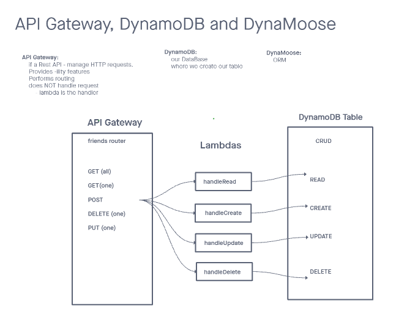

# LAB - Class 18

## Project: AWS: API, Dynamo and Lambda

## Author: Steve Gant (collaborated with Marco Villafana)

### Problem Domain
Create a single resource REST API using a domain model of your choosing, constructed using AWS Cloud Services.

### Links and Resources
- [GitHub PR](https://github.com/stevengant/serverless-rest-api/pull/2)

### Features / Routes
- Feature One: Details of feature

- POST : /people/ - Given a JSON body, inserts a record into the database.

    - returns an object representing one record, by its id (##).
- GET : /people/:id - returns an array of objects representing the records in the database.

- GET : /people/:id - returns an object representing one record, by its id (##).

- PUT : /people/:id - Given a JSON body and an ID (##), updates a record in the database.

    - returns an object representing one record, by its id (##).
- DELETE : /people/:id - Given an id (##) removes the matching record from the database.

    - returns an empty object.

### UML

[UML from today's freehand](https://projects.invisionapp.com/freehand/document/aVGGthcbV)